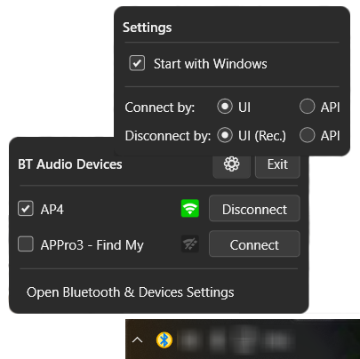

# QuickBTTray

A lightweight Windows tray application for quick management of Bluetooth audio devices.



I created this app because AirPods don’t support automatic switching between an iPhone and a PC. While they stay paired to both, manually connecting through Windows 11 Bluetooth menus several times a day quickly becomes tedious. This app minimizes that friction: a simple left-click on the tray icon instantly toggles the connection of the devices you’ve selected in the apps menu.

Note that due to Windows limitations, fully disconnecting a Bluetooth device via API will prevent it from reconnecting properly. To avoid this, the app only disconnects the audio and microphone rather than the device itself. For a complete connection toggle, I recommend using the automated UI navigation setting instead, which works as intended.

## Features
- Lives in the system tray with a modern, theme-aware menu
- One-click on the tray icon to connect/disconnect for selected Bluetooth audio devices
- Double click the tray icon to open Bluetooth settings.
- Manual connect/disconnect buttons for each device
- Visual status icons for device connection state
- Tray icon animates during connect/disconnect
- Supports both API and UI (Windows Settings) connection methods
- "Start with Windows" option (adds/removes registry entry)
- Settings menu for connection method and app options
- "Open Bluetooth & Devices Settings" shortcut
- Dark/light mode support

## How It Works
- The app scans for Bluetooth audio devices and lists them in the tray menu.
- Select devices with checkboxes for batch connect/disconnect.
- Single left-click the tray icon to connect/disconnect selected devices.
- Double left-click opens Windows Bluetooth & Devices settings.
- Right-click opens the full menu with device controls and settings.
- The tray icon blinks when connecting/disconnecting.
- "Start with Windows" stores the app's path in the registry at:
	`HKEY_CURRENT_USER\SOFTWARE\Microsoft\Windows\CurrentVersion\Run`

## Usage Instructions
1. **Run QuickBTTray.exe** (standalone, no install required)
2. **Select your Bluetooth audio devices** in the tray menu
3. **Click the tray icon** to connect/disconnect selected devices
4. **Use the gear/settings menu** to choose connection method or enable startup
5. **Open Bluetooth settings** from the menu if needed

## Requirements
- Windows 10/11
- .NET 8.0 Desktop Runtime (if using the smaller, non-standalone EXE)

## Building
- To build a portable, standalone EXE:
	```
	dotnet publish -c Release -r win-x64 --self-contained true -p:PublishSingleFile=true -o publish
	```
- For a smaller EXE (requires .NET 8 runtime on target):
	```
	dotnet publish -c Release -r win-x64 --self-contained false -p:PublishSingleFile=true -o publish-trimmed
	```

## Notes
- The app does not collect or transmit any user data.
- If you move the EXE, re-enable "Start with Windows" to update the registry path.
- For best results with UI automation, avoid interacting with the PC until the connection completes.

## License
MIT License
